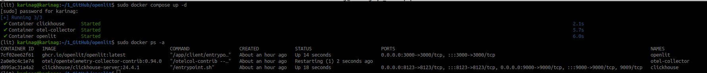
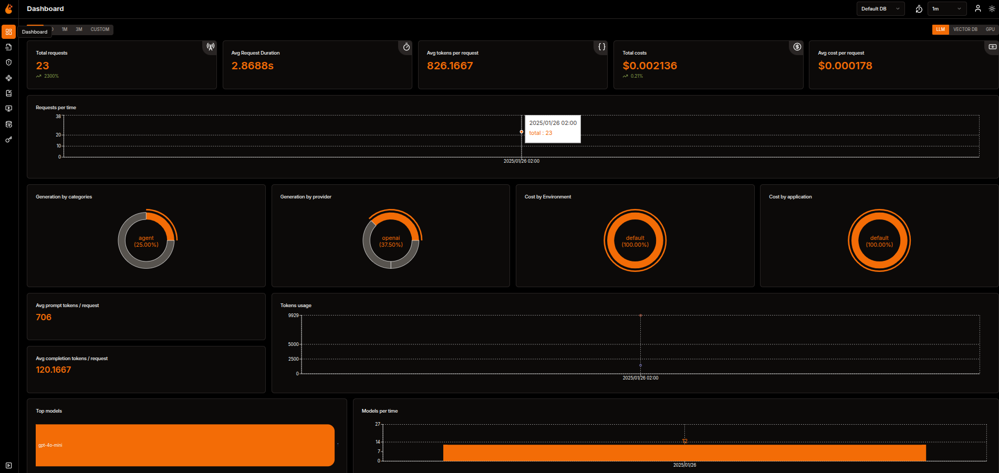
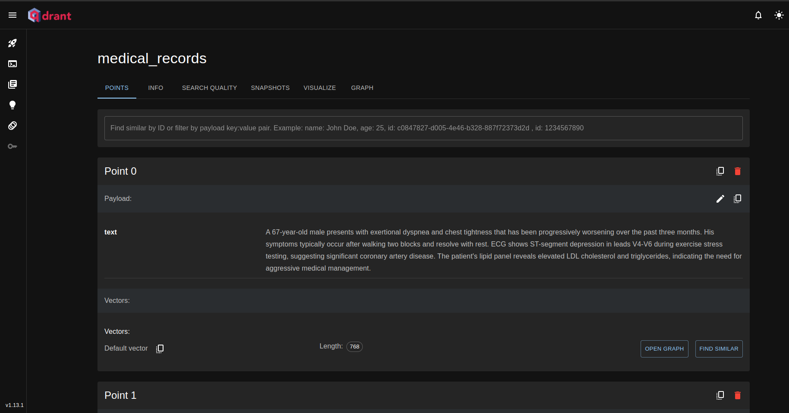

# <h1 align="center"><font color="red">Healthcare with Agentic RAG</font></h1>

<font color="pink">Senior Data Scientist.: Dr. Eddy Giusepe Chirinos Isidro</font>


In this repository we created an Agentic Rag using crewai and qdrant and applied it to the healthcare sector.

This project was inspired by the author: [M K Pavan Kumar](https://ai.gopubby.com/building-agentic-rag-pipelines-for-medical-data-with-crewai-and-qdrant-3a00a48fb0d1) e [aqui](https://github.com/pavanjava/healthcare_agentic_rag/tree/main).


`OpenLIT` é uma plataforma Open Source para Engenharia de IA. O `OpenLIT` permite que você simplifique seu fluxo de trabalho de desenvolvimento de IA, especialmente para `IA Generativa` e `LLMs`. Ele simplifica tarefas essenciais como experimentar com LLMs, organizar e controlar versões de prompts e manipular chaves de API com segurança. Com apenas uma linha de código, você pode habilitar a observabilidade nativa do OpenTelemetry , oferecendo monitoramento full-stack que inclui LLMs, bancos de dados vetoriais e GPUs. Isso permite que os desenvolvedores criem recursos e aplicativos de IA com confiança, fazendo uma transição suave do teste para a produção.

Este projeto segue e mantém com orgulho as Convenções Semânticas com a comunidade OpenTelemetry, atualizando-as constantemente para se alinhar aos padrões mais recentes em Observabilidade.

Alguns links de estudo sobre `OpenLIT`:

* [Observability and Evals for LLMs with OpenLIT Locally - OpenAI Integration](https://www.youtube.com/watch?v=tO3NsndY_xU&t=476s)

* [GitHub: OpenLIT](https://github.com/openlit/openlit)

Usamos os seguintes comandos para instalar o `OpenLIT` no ambiente local:

```bash
conda create -n lit python=3.11 -y && conda activate lit

conda activate lit

pip install torch transformers

git clone https://github.com/openlit/openlit.git

cd openlit

docker compose up -d     ou     docker compose up

sudo docker compose down

pip install openlit
```

Para instanciar o `OpenLIT` basta rodar o comando `docker compose up -d` no terminal, assim:




Basta ir até `OpenLIT` em `127.0.0.1:3000` seu navegador para começar a explorar. Você pode fazer login usando as credenciais padrão

E-mail : `user@openlit.io`

Senha : `openlituser`

Você verá a seguinte tela:




Seu banco de dados vetorial é o `Qdrant`. A interface web do `Qdrant` com nossos dados é a seguinte:




Thank God!